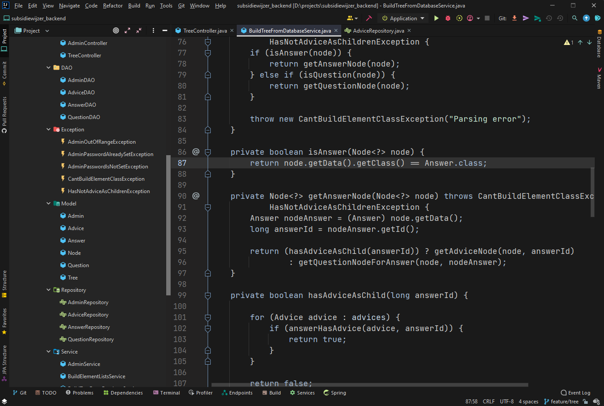
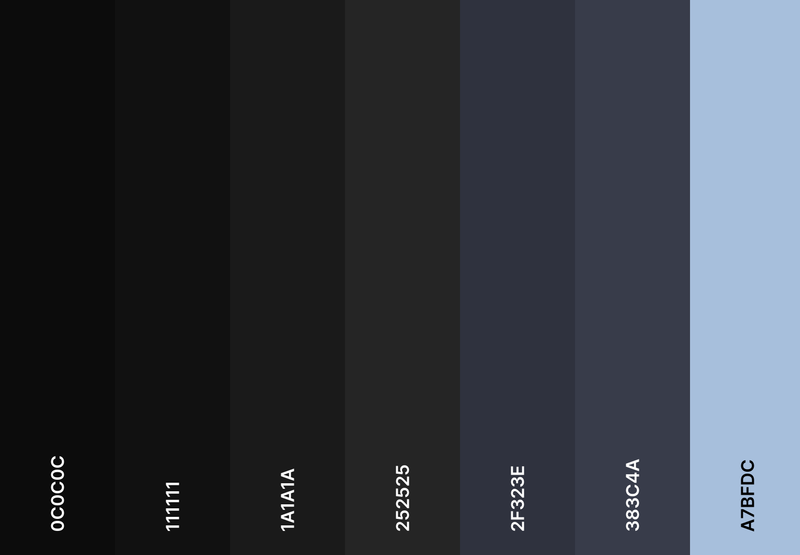
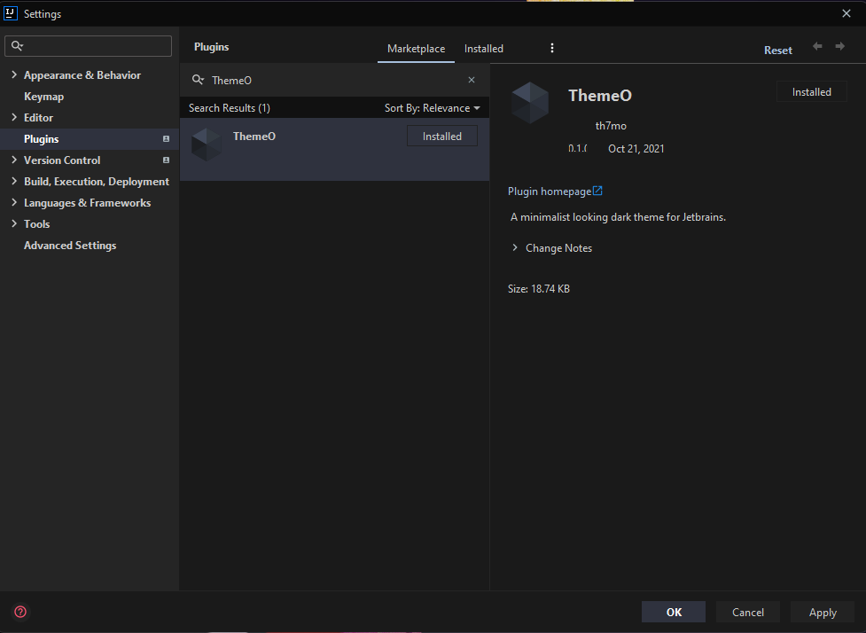

# ThemeO

<!-- Plugin description -->
A minimalistic looking dark theme for Jetbrains. Designed for a streamlined workflow based on a custom color palette.
<!-- Plugin description end -->

## Color Palette

## Installation

- Using IDE built-in plugin system:
  
  <kbd>Settings/Preferences</kbd> > <kbd>Plugins</kbd> > <kbd>Marketplace</kbd> > <kbd>Search for "ThemeO"</kbd> >
  
  
  
  <kbd>Install Plugin</kbd>
  
- Manually:

  Download the [latest release](https://github.com/Th7mo/ThemeO/releases/latest) and install it manually using
  <kbd>Settings/Preferences</kbd> > <kbd>Plugins</kbd> > <kbd>⚙️</kbd> > <kbd>Install plugin from disk...</kbd>

